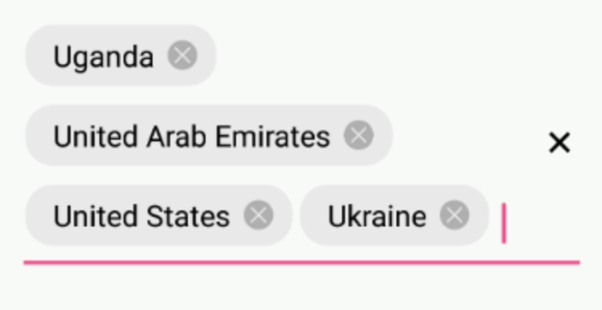

# Enabling the AutoSizing API

AutoSizing can be enabled in SfAutoComplete control so that the control will extend its layout based on the token size.

`EnableAutoSize` property is used to enable the AutoSizing in `SfAutoComplete` control. To enable the API, you need to set the `MultiSelectMode` as `Token` and `TokensWrapMode` as `Wrap`. The default value of `EnableAutoSize` is false.




<?xml version="1.0" encoding="utf-8"?>
<ContentPage xmlns="http://xamarin.com/schemas/2014/forms"
             xmlns:x="http://schemas.microsoft.com/winfx/2009/xaml"
             xmlns:d="http://xamarin.com/schemas/2014/forms/design"
              xmlns:ListCollection="clr-namespace:System.Collections.Generic;assembly=netstandard"
             xmlns:autocomplete="clr-namespace:Syncfusion.SfAutoComplete.XForms;assembly=Syncfusion.SfAutoComplete.XForms"
             xmlns:mc="http://schemas.openxmlformats.org/markup-compatibility/2006"
             mc:Ignorable="d" x:Class="LayoutsExample.MainPage">
    <StackLayout VerticalOptions="Start" HorizontalOptions="Start" Padding="30">
        <autocomplete:SfAutoComplete x:Name="autoComplete" EnableAutoSize="True" MultiSelectMode="Token" TokensWrapMode="Wrap">
            <autocomplete:SfAutoComplete.AutoCompleteSource>
                <ListCollection:List x:TypeArguments="x:String">
                    <x:String>Uganda</x:String>
                    <x:String>Ukraine</x:String>
                    <x:String>United Arab Emirates</x:String>
                    <x:String>United Kingdom</x:String>
                    <x:String>United States</x:String>
                </ListCollection:List>
            </autocomplete:SfAutoComplete.AutoCompleteSource>
        </autocomplete:SfAutoComplete>
    </StackLayout>
</ContentPage>
		  


	
using System;
using System.Collections.Generic;
using System.ComponentModel;
using System.Linq;
using System.Text;
using System.Threading.Tasks;
using Syncfusion.SfAutoComplete.XForms;
using Xamarin.Forms;

namespace LayoutsExample
{
    // Learn more about making custom code visible in the Xamarin.Forms previewer
    // by visiting https://aka.ms/xamarinforms-previewer
    [DesignTimeVisible(false)]
    public partial class MainPage : ContentPage
    {
        public MainPage()
        {
            InitializeComponent();

            StackLayout layout = new StackLayout()
            {
                VerticalOptions = LayoutOptions.Start,
                HorizontalOptions = LayoutOptions.Start,
                Padding = new Thickness(30)
            };
            List<String> countryNames = new List<String>();
            countryNames.Add("Uganda");
            countryNames.Add("Ukraine");
            countryNames.Add("United Arab Emirates");
            countryNames.Add("United Kingdom");
            countryNames.Add("United States");

            SfAutoComplete autoComplete = new SfAutoComplete();
            autoComplete.AutoCompleteSource = countryNames;
            autoComplete.EnableAutoSize = true;
            autoComplete.MultiSelectMode = MultiSelectMode.Token;
            autoComplete.TokensWrapMode = TokensWrapMode.Wrap;
            layout.Children.Add(autoComplete);
            Content = layout;
        }
    }
}
	 



