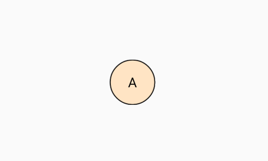

# Customization 

## Customization in Xamarin Avatar View(SfAvatarView)

The SfAvatarView control provides options to customize the color and size. The control can be customized using the following properties:

## Colors

Color in the SfAvatarView can be customized by the border color, the default background color, and automatic background color.

### Border color

The border color is used for setting color to the border of SfAvatarView using the `BorderColor` property.





   <Grid>
        <sfavatar:SfAvatarView  ContentType="Default"  
                                AvatarShape="Circle"
                                AvatarSize="Large"
                                HorizontalOptions="Center"
                                VerticalOptions="Center"
                                ImageSource="ellanaa.png"
                                BorderColor="Red">
        </sfavatar:SfAvatarView>
   </Grid>





            Grid mainGrid = new Grid();
            SfAvatarView avatarview = new SfAvatarView();
            avatarview.ContentType = ContentType.Default;
            avatarview.AvatarShape = AvatarShape.Circle;
            avatarview.AvatarSize = AvatarSize.Large;
            avatarview.VerticalOptions = LayoutOptions.Center;
            avatarview.HorizontalOptions = LayoutOptions.Center;
            avatarview.ImageSource = "ellanaa.png";
            avatarview.BorderColor = Color.Red;
            mainGrid.Children.Add(avatarview);
            this.Content = mainGrid;





### Default background color

The background color for the SfAvatarView control can be set using the `AvatarColorMode` property. When the `AvatarColorMode` property is set to default, it displays the background color set in the `BackgroundColor` property.





   <Grid>
        <sfavatar:SfAvatarView ContentType="Initials"
                               AvatarShape="Circle"
                               AvatarSize="Large"
                               HorizontalOptions="Center"
                               VerticalOptions="Center"
                               AvatarName="Alex"          
                               BackgroundColor="Bisque"
                               AvatarColorMode="Default"
                               BorderColor="Black">
        </sfavatar:SfAvatarView>
   </Grid>
      





            Grid mainGrid = new Grid();
            SfAvatarView avatarview = new SfAvatarView();
            avatarview.ContentType = ContentType.Initials;
            avatarview.AvatarShape = AvatarShape.Circle;
            avatarview.AvatarSize = AvatarSize.Large;
            avatarview.VerticalOptions = LayoutOptions.Center;
            avatarview.HorizontalOptions = LayoutOptions.Center;
            avatarview.AvatarName = "Alex";
            avatarview.BorderColor = Color.Black;
            avatarview.AvatarColorMode = AvatarColorMode.Default;
            avatarview.BackgroundColor = Color.Bisque;
            mainGrid.Children.Add(avatarview);
            this.Content = mainGrid;





### Automatic background color

The `SfAvatarView` control allows automatic background color while initializing. It contains the following properties:

* `DarkBackground`: Shows a dark color for the initials and background color.
* `LightBackground`: Shows a light color for the initials and background color.

#### Dark color

The dark background color can be set using `DarkBackground` in the `AvatarColorMode` property.





   <Grid>
        <sfavatar:SfAvatarView ContentType="Initials"
                               InitialsType="DoubleCharacter"
                               AvatarShape="Circle"
                               AvatarSize="Large"
                               HorizontalOptions="Center"
                               VerticalOptions="Center"
                               AvatarName="Alex"
                               AvatarColorMode="DarkBackground"
                               BorderColor="Black">
        </sfavatar:SfAvatarView>
   </Grid>





            Grid mainGrid = new Grid();
            SfAvatarView avatarview = new SfAvatarView();
            avatarview.VerticalOptions = LayoutOptions.Center;
            avatarview.HorizontalOptions = LayoutOptions.Center;
            avatarview.AvatarShape = AvatarShape.Circle;
            avatarview.AvatarSize = AvatarSize.Large;
            avatarview.ContentType = ContentType.Initials;
            avatarview.InitialsType = InitialsType.DoubleCharacter;
            avatarview.AvatarName = "Alex";
            avatarview.BorderColor = Color.Black;
            avatarview.AvatarColorMode = AvatarColorMode.DarkBackground;
            mainGrid.Children.Add(avatarview);
            this.Content = mainGrid;





#### Light color

The light background color can be set using `LightBackground` in the `AvatarColorMode` property.





   <Grid>
        <sfavatar:SfAvatarView ContentType="Initials"
                               InitialsType="DoubleCharacter"
                               VerticalOptions="Center"
                               AvatarName="Alex"
                               AvatarShape="Circle"
                               AvatarSize="Large"
                               AvatarColorMode="LightBackground"
                               BorderColor="Black"
                               HorizontalOptions="Center" >
        </sfavatar:SfAvatarView>
   </Grid>




  
            Grid mainGrid = new Grid();
            SfAvatarView avatarview = new SfAvatarView();
            avatarview.VerticalOptions = LayoutOptions.Center;
            avatarview.HorizontalOptions = LayoutOptions.Center;
            avatarview.AvatarShape = AvatarShape.Circle;
            avatarview.AvatarSize = AvatarSize.Large;
            avatarview.ContentType = ContentType.Initials;
            avatarview.InitialsType = InitialsType.DoubleCharacter;
            avatarview.AvatarName = "Alex";
            avatarview.BorderColor = Color.Black;
            avatarview.AvatarColorMode = AvatarColorMode.LightBackground;
            mainGrid.Children.Add(avatarview);
            this.Content = mainGrid;





### Gradients

You can also specify a range of colors using `BackgroundGradient` as demonstrated in the following code example.





            xmlns:gradient ="clr-namespace:Syncfusion.XForms.Graphics;assembly=Syncfusion.Core.XForms"
................
        <sfavatar:SfAvatarView ContentType="Initials" 
                               AvatarName="Alex"
                               AvatarShape="Circle"
                               AvatarSize="Large"
                               HorizontalOptions="Center"
                               VerticalOptions="Center"      
                               InitialsType="DoubleCharacter">
            <sfavatar:SfAvatarView.BackgroundGradient>
                <gradient:SfLinearGradientBrush>
                    <gradient:SfLinearGradientBrush.GradientStops>
                        <gradient:SfGradientStop Color="#2F9BDF" Offset="0"/>
                        <gradient:SfGradientStop Color="#51F1F2" Offset="1"/>
                    </gradient:SfLinearGradientBrush.GradientStops>
                </gradient:SfLinearGradientBrush>
            </sfavatar:SfAvatarView.BackgroundGradient>
        </sfavatar:SfAvatarView>
  





            using Syncfusion.XForms.Graphics;
            .......

            SfLinearGradientBrush gradientBrush = new SfLinearGradientBrush();
            gradientBrush.GradientStops = new GradientStopCollection()
            {
                new SfGradientStop(){ Color = Color.FromHex("#2F9BDF"), Offset = 0 },
                new SfGradientStop(){ Color = Color.FromHex("#51F1F2"), Offset = 1 }
            };

            Grid mainGrid = new Grid();
            SfAvatarView avatarview = new SfAvatarView();
            avatarview.VerticalOptions = LayoutOptions.Center;
            avatarview.HorizontalOptions = LayoutOptions.Center;
            avatarview.AvatarShape = AvatarShape.Circle;
            avatarview.AvatarSize = AvatarSize.Large;
            avatarview.ContentType = ContentType.Initials;
            avatarview.InitialsType = InitialsType.DoubleCharacter;
            avatarview.AvatarName = "Alex";
            avatarview.BorderColor = Color.Black;
            avatarview.BackgroundGradient = gradientBrush;
            mainGrid.Children.Add(avatarview);
            this.Content = mainGrid;





N> Here, the `BackgroundGradient` is a type of `SfGradientBrush`, so you can apply `SfLinearGradientBrush` on it. This `SfLinearGradientBrush` is available in [`Syncfusion.Xamarin.Core`](https://www.nuget.org/packages/Syncfusion.Xamarin.Core) from [`nuget.org`](https://www.nuget.org/). To know more about gradient view, refer to this [documentation](https://help.syncfusion.com/xamarin/sfgradientview/getting-started).

## Sizing

In the `SfAvatarView` control, size of the view can be controlled using width, height, border width, and corner radius.

### Width

You can customize the width of the avatar view using the `WidthRequest` property.

### Height

You can customize the height of the avatar view using the `HeightRequest` property.

### Border width

You can customize the thickness of the avatar view using the `BorderWidth` property.





   <Grid>
        <sfavatar:SfAvatarView ContentType="Default"
                               AvatarShape="Circle"
                               AvatarSize="Large"
                               ImageSource="ellanaa.png"
                               BorderColor="Red" 
                               VerticalOptions="Center"
                               BorderWidth="4"
                               HorizontalOptions="Center" >
        </sfavatar:SfAvatarView>
   </Grid>





            Grid mainGrid = new Grid();
            SfAvatarView avatarview = new SfAvatarView();
            avatarview.HorizontalOptions = LayoutOptions.Center;
            avatarview.VerticalOptions = LayoutOptions.Center;
            avatarview.AvatarShape = AvatarShape.Circle;
            avatarview.AvatarSize = AvatarSize.Large;
            avatarview.BorderWidth = 4;
            avatarview.BorderColor = Color.Red,
            avatarview.ContentType = ContentType.Default;
            avatarview.ImageSource = "ellanaa.png";
            mainGrid.Children.Add(avatarview);
            this.Content = mainGrid;





### Corner radius

You can customize the corner radius of the avatar view using the `CornerRadius` property.





   <Grid>
        <sfavatar:SfAvatarView ContentType="Default"
                               ImageSource="ellanaa.png"
                               HorizontalOptions="Center"
                               VerticalOptions="Center"   
                               WidthRequest="60"
                               HeightRequest="60"
                               CornerRadius="20">
        </sfavatar:SfAvatarView>
   </Grid>





            Grid mainGrid = new Grid();
            SfAvatarView avatarview = new SfAvatarView();
            avatarview.HorizontalOptions = LayoutOptions.Center;
            avatarview.VerticalOptions = LayoutOptions.Center;
            avatarview.WidthRequest = 60;
            avatarview.HeightRequest = 60;
            avatarview.CornerRadius = 20;
            avatarview.ImageSource = "ellanaa.png";
            avatarview.ContentType = ContentType.Default;
            mainGrid.Children.Add(avatarview);
            this.Content = mainGrid;





