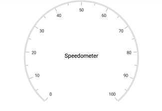
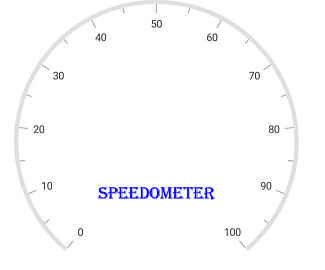

---

layout: post
title: Header in Syncfusion SfCircularGauge control for Xamarin.Forms
description: This section explains the steps required to add and customize header in Syncfusion Circular Gauge control for Xamarin.Forms
platform: xamarin
control: SfCircularGauge
documentation: ug

---

# Header in SfCircularGauge

The [`Header`](https://help.syncfusion.com/cr/xamarin/Syncfusion.SfGauge.XForms.Header.html) support allows you to show text inside the gauge control. A circular gauge can be made self-descriptive about the data. It can be  measured with use of the header.

## Adding header in circular gauge

###  Header

The [`Header`](https://help.syncfusion.com/cr/xamarin/Syncfusion.SfGauge.XForms.Header.html) can be used to set a unique header for the circular gauge. You can add text as headers in a circular gauge. Multiple headers also can be added in a circular gauge.





     <gauge:SfCircularGauge>
	  
         <gauge:SfCircularGauge.Headers>
            <gauge:Header Text="Speedometer" ForegroundColor="Black" />
        </gauge:SfCircularGauge.Headers>
     </gauge:SfCircularGauge>





    SfCircularGauge circularGauge = new SfCircularGauge(); 
    Header header = new Header();
    header.Text = "Speedometer";
    header.ForegroundColor = Color.Black;
    circularGauge.Headers.Add(header); 





##  Setting position for header

The [`Position`](https://help.syncfusion.com/cr/xamarin/Syncfusion.SfGauge.XForms.Header.html#Syncfusion_SfGauge_XForms_Header_Position) property is used to place the header in a circular gauge. The value for [`Position`](https://help.syncfusion.com/cr/xamarin/Syncfusion.SfGauge.XForms.Header.html#Syncfusion_SfGauge_XForms_Header_Position) should be specified in offset value. In the Point value, which has been given for the `Position`, first value represent x-coordinate and second value represents y-coordinate. By default, it is placed at (0.5, 0.7).




 
     <gauge:SfCircularGauge>
        <gauge:SfCircularGauge.Headers>
            <gauge:Header Text="Speedometer" Position="0.5,0.5" ForegroundColor="Black" />
        </gauge:SfCircularGauge.Headers>
     </gauge:SfCircularGauge>





    SfCircularGauge circularGauge = new SfCircularGauge(); 
    Header header = new Header();
    header.Text = "Speedometer";
    header.ForegroundColor = Color.Black;
    header.Position = new Point(0.5, 0.5);
    circularGauge.Headers.Add(header); 
    




##  Customization of header

You can customize the header's text by using the [`FontFamily`](https://help.syncfusion.com/cr/xamarin/Syncfusion.SfGauge.XForms.Header.html#Syncfusion_SfGauge_XForms_Header_FontFamily), [`FontAttribute`](https://help.syncfusion.com/cr/xamarin/Syncfusion.SfGauge.XForms.Header.html#Syncfusion_SfGauge_XForms_Header_FontAttributes) and [`TextSize`](https://help.syncfusion.com/cr/xamarin/Syncfusion.SfGauge.XForms.Header.html#Syncfusion_SfGauge_XForms_Header_TextSize) properties.




 
    <gauge:SfCircularGauge>
         <gauge:SfCircularGauge.Headers>
             <gauge:Header Text="Speedometer" TextSize="20" ForegroundColor="Blue" FontAttributes="Bold">
			        <gauge:Header.FontFamily>
                        <OnPlatform x:TypeArguments="x:String" iOS="Chalkduster" Android="algerian.ttf" WinPhone="Chiller" />
                    </gauge:Header.FontFamily>
		     </gauge:Header>
        </gauge:SfCircularGauge.Headers>
    </gauge:SfCircularGauge>





    SfCircularGauge circularGauge = new SfCircularGauge(); 
    Header header = new Header();
    header.Text = "Speedometer";
    header.TextSize = 20;
    header.FontAttributes = FontAttributes.Bold;
    header.FontFamily = Device.RuntimePlatform == Device.iOS ? "Chalkduster" : Device.RuntimePlatform == Device.Android ? "algerian.ttf" : "Chiller";
    header.ForegroundColor = Color.Blue;   
    circularGauge.Headers.Add(header); 
    this.content = circularGauge;
    




## Alignment of header

You can align header to the `Start`, `Center` and `End` using the [`HorizontalHeaderPosition`](https://help.syncfusion.com/cr/xamarin/Syncfusion.SfGauge.XForms.Header.html#Syncfusion_SfGauge_XForms_Header_HorizontalHeaderPosition) and [`VerticalHeaderPosition`](https://help.syncfusion.com/cr/xamarin/Syncfusion.SfGauge.XForms.Header.html#Syncfusion_SfGauge_XForms_Header_VerticalHeaderPosition) properties.

### Setting horizontal header position




 
<gauge:SfCircularGauge>
    <gauge:SfCircularGauge.Headers>
        <gauge:Header Text="Speedometer" ForegroundColor="Black" HorizontalHeaderPosition="Start"/>
    </gauge:SfCircularGauge.Headers>
</gauge:SfCircularGauge>





SfCircularGauge circularGauge = new SfCircularGauge();
Header header = new Header();
header.Text = "Speedometer";
header.ForegroundColor = Color.Black;
header.HorizontalHeaderPosition = ViewAlignment.Start;
circularGauge.Headers.Add(header);
Content = circularGauge;
    




### Setting vertical header position




 
<gauge:SfCircularGauge>
    <gauge:SfCircularGauge.Headers>
        <gauge:Header Text="Speedometer" ForegroundColor="Black" VerticalHeaderPosition="Start"/>
    </gauge:SfCircularGauge.Headers>
</gauge:SfCircularGauge>





SfCircularGauge circularGauge = new SfCircularGauge();
Header header = new Header();
header.Text = "Speedometer";
header.ForegroundColor = Color.Black;
header.VerticalHeaderPosition = ViewAlignment.Start;
circularGauge.Headers.Add(header);
Content = circularGauge;
    




