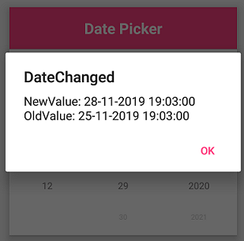

# How to

## How to show as a Dialog

DatePicker can be rendered as a dialog by setting the`SfDatePicker.PickerMode` property to Dialog. The default value of `SfDatePicker.PickerMode` property is "Default". 





<?xml version="1.0" encoding="utf-8" ?>
<ContentPage xmlns="http://xamarin.com/schemas/2014/forms"
             xmlns:x="http://schemas.microsoft.com/winfx/2009/xaml"
             xmlns:local="clr-namespace:DatePickerSample"
             xmlns:syncfusion="clr-namespace:Syncfusion.XForms.Pickers;assembly=Syncfusion.SfPicker.XForms"
             x:Class="DatePickerSample.MainPage">
    <ContentPage.Content>
        <syncfusion:SfDatePicker x:Name="DatePicker"
                                 PickerMode="Dialog"/>
    </ContentPage.Content>
</ContentPage>





using Syncfusion.XForms.Pickers;
using Xamarin.Forms;

namespace DatePickerSample
{
    public partial class MainPage : ContentPage
    {
        public MainPage()
        {
            InitializeComponent();
            SfDatePicker datePicker = new SfDatePicker()
            {
                PickerMode = DatePickerMode.Dialog
            };

            this.Content = datePicker;
        }
    }
}





The DatePicker can be opened programmatically by setting the `SfDatePicker.IsOpen` property to true. Default value of `SfDatePicker.IsOpen` is "false".

Note: This property is automatically changed to false when you close the dialog by clicking outside of the dialog.





<?xml version="1.0" encoding="utf-8" ?>
<ContentPage xmlns="http://xamarin.com/schemas/2014/forms"
             xmlns:x="http://schemas.microsoft.com/winfx/2009/xaml"
             xmlns:local="clr-namespace:DatePickerSample"
             xmlns:syncfusion="clr-namespace:Syncfusion.XForms.Pickers;assembly=Syncfusion.SfPicker.XForms"
             x:Class="DatePickerSample.MainPage">
    <ContentPage.Content>
        <Grid>
        <syncfusion:SfDatePicker x:Name="datepicker"
                                 PickerMode="Dialog"/>
        <Button Text="Open Picker" 
                x:Name="pickerButton"
                Clicked="Button_Clicked"
                HorizontalOptions="Center"
                VerticalOptions="Center"
                HeightRequest="50" 
                WidthRequest="100"/>
        </Grid>
    </ContentPage.Content>
</ContentPage>





using Xamarin.Forms;

namespace DatePickerSample
{
    public partial class MainPage : ContentPage
    {
        public MainPage()
        {
            InitializeComponent();
        }

        private void Button_Clicked(object sender, System.EventArgs e)
        {
            datepicker.IsOpen = true;
        }
    }
}





## How to handle date changed using the DateSelected event

You can perform an operation when selecting a date using the `DateSelected` event. The DateSelected event returns the following arguments:

<table>
<tr>
<th>Members</th>
<th>Description</th>
</tr>
<tr>
<td>NewDate</td>
<td>Shows recently selected date in DatePicker.</td>
</tr>
<tr>
<td>OldDate</td>
<td>Shows previously selected date in DatePicker.</td>
</tr>
</table>





<?xml version="1.0" encoding="utf-8" ?>
<ContentPage xmlns="http://xamarin.com/schemas/2014/forms"
             xmlns:x="http://schemas.microsoft.com/winfx/2009/xaml"
             xmlns:local="clr-namespace:DatePickerSample"
             xmlns:syncfusion="clr-namespace:Syncfusion.XForms.Pickers;assembly=Syncfusion.SfPicker.XForms"
             x:Class="DatePickerSample.MainPage">
    <ContentPage.Content>
        <syncfusion:SfDatePicker x:Name="datepicker"
                                 DateSelected="Datepicker_DateSelected"/>
    </ContentPage.Content>
</ContentPage>



  

using Syncfusion.XForms.Pickers;
using Xamarin.Forms;

namespace DatePickerSample
{
    public partial class MainPage : ContentPage
    {
        SfDatePicker datePicker;
        public MainPage()
        {
            InitializeComponent();
            datePicker = new SfDatePicker();
            datePicker.DateSelected += Datepicker_DateSelected;
            this.Content = datePicker;
        }

        private void Datepicker_DateSelected(object sender, Syncfusion.XForms.Pickers.DateChangedEventArgs e)
        {
            DisplayAlert("DateChanged", "NewDate: " + e.NewDate + "\n" + "OldDate: " + e.OldDate, "Ok");
        }
    }
}





