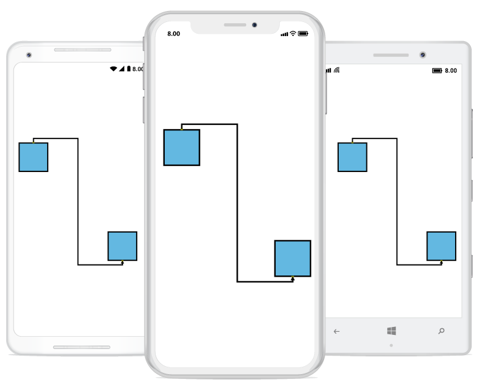

# Port
SfDiagram provides support to define custom ports for making connections. When a Connector is connected between two Nodes, its end points are automatically docked to Node’s nearest boundary, Port act as the connection points of node and allows to create connections with only specific points.

## Create ports for a node
To add a port, you need to define the port object and add it to Ports property of Node. The NodeOffsetX and NodeOffsetY property of Port accepts an object of fractions and used to determine the position of Ports. The following code illustrates how to add ports when initializing the Node.
The following code illustrates how to add ports to Node.


<!--creating node instance-->
<control:Node x:Name="node1" OffsetX="300" OffsetY="300" Width="100" Height="100" ShapeType="Rectangle" >
                        <!--creating port instance-->
                        <control:Node.Ports >
                            <control:PortCollection>
                                <control:Port x:Name="port1" NodeOffsetX="0.5" NodeOffsetY="1"/>
                            </control:PortCollection>
                        </control:Node.Ports >
</control:Node>


//Creating node instance
Node node1 = new Node() { OffsetX = 300, OffsetY = 300, Width = 100, Height = 100, ShapeType = ShapeType.Rectangle };
sfDiagram.AddNode(node1);
Node node2 = new Node() { OffsetX = 600, OffsetY = 600, Width = 100, Height = 100, ShapeType = ShapeType.Rectangle };
sfDiagram.AddNode(node2);

// creating port instance
Port port1 = new Port();
port1.NodeOffsetX = 0.5;
port1.NodeOffsetY = 0;
Port port2 = new Port();
port2.NodeOffsetX = 0.5;
port2.NodeOffsetY = 1;

//adding port to the node instance
node1.Ports.Add(port1);
node2.Ports.Add(port2);

//creating and connecting the ports with connector
Connector connector = new Connector() { SourceNode = node1, TargetNode = node2, SourcePort = port1, TargetPort = port2 };
sfDiagram.AddConnector(connector);



## Accessing a port from the node instance
You can access the port by its index from the Ports property in a node.
The following code illustrates how to access a port from the node instance.


Node node = sfDiagram.Nodes[0];
//Accessing the port by index from the Port collection in node
Port port = node.Ports[0];



## Remove a port from the node
To remove the port from a node. You can use Remove() method in Ports property in a node.
The following code illustrates how to remove a port from the node.


Node node = sfDiagram.Nodes[0];
//Accessing the port by index from the Port collection in node
Port port = node.Ports[0];
//Removing the port for the node 
node.Ports.Remove(port);



## Customization
You can customize a port by resizing it and applying style to it.
The following code illustrates how to customization a port.


<control:Node x:Name="node1" OffsetX="300" OffsetY="300" Width="100" Height="100" ShapeType="Rectangle" >
    <!--creating port instance-->
    <control:Node.Ports >
        <control:PortCollection>
            <control:Port x:Name="port1" NodeOffsetX="0.5" NodeOffsetY="1" Height="10" Width="10" ShapeType=" Circle">
                <control:Port.Style>
                    <control:Style StrokeWidth="3" />
                </control:Port.Style>
            </control:Port>
        </control:PortCollection>
    </control:Node.Ports >
</control:Node>


//Creating a node
Node node1 = new Node() { OffsetX = 300, OffsetY = 300, Width = 100, Height = 100, ShapeType = ShapeType.Rectangle };
sfDiagram.AddNode(node1);

// creating a port 
Port port = new Port();
port.NodeOffsetX = 0.5;
port.NodeOffsetY = 1;

//adding the port to the node instance
node1.Ports.Add(port);

port.Height = 10;
port.Width = 10;
//Setting the shape type for the port
port.ShapeType = ShapeType.Circle;
//Creating style instance for the port 
Style style = new Style();
style.StrokeWidth = 3;
style.Brush = new SolidBrush(Color.Black);
port.Style = style;


