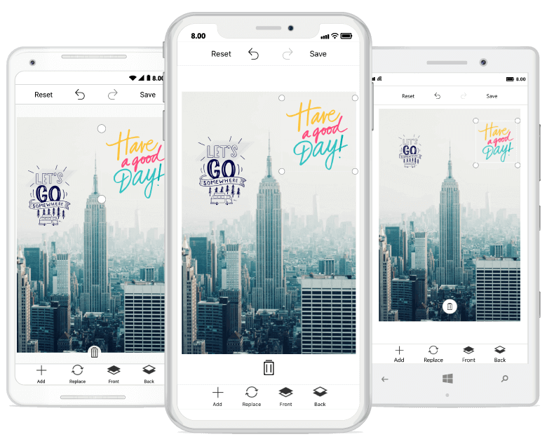
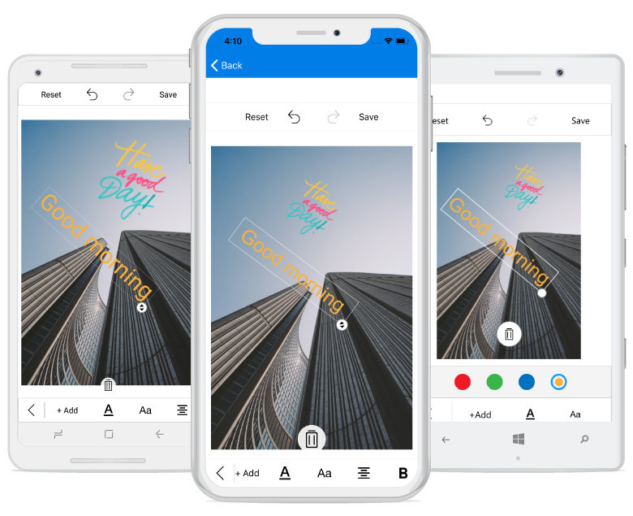

# CustomView in SfImageEditor

You can add any custom shapes or views to an image using the [`AddCustomView`](https://help.syncfusion.com/cr/xamarin/Syncfusion.SfImageEditor.XForms.SfImageEditor.html#Syncfusion_SfImageEditor_XForms_SfImageEditor_AddCustomView_System_Object_Syncfusion_SfImageEditor_XForms_CustomViewSettings_) method in the image editor control. To add a custom view, specify the view and its desired [`CustomViewSettings`](https://help.syncfusion.com/cr/xamarin/Syncfusion.SfImageEditor.XForms.CustomViewSettings.html) as shown in the following code snippet.



        Image customImage = new Image() { HeightRequest = 200, WidthRequest = 200  };
        Assembly assembly = Assembly.GetAssembly(typeof(Sample));
        customImage.Source = ImageSource.FromResource("sample_namespace.CustomImage.png", assembly);
        imageEditor.AddCustomView(customImage, new CustomViewSettings());
  


## CustomViewSettings

The CustomViewSettings is defined to set the values for [`CanMaintainAspectRatio`](https://help.syncfusion.com/cr/xamarin/Syncfusion.SfImageEditor.XForms.CustomViewSettings.html#Syncfusion_SfImageEditor_XForms_CustomViewSettings_CanMaintainAspectRatio), [`Bounds`](https://help.syncfusion.com/cr/xamarin/Syncfusion.SfImageEditor.XForms.CustomViewSettings.html#Syncfusion_SfImageEditor_XForms_CustomViewSettings_Bounds) and [`Angle`](https://help.syncfusion.com/cr/xamarin/Syncfusion.SfImageEditor.XForms.CustomViewSettings.html#Syncfusion_SfImageEditor_XForms_CustomViewSettings_Angle).

* The CanMaintainAspectRatio property is used to decide whether the aspect ratio value needs to be maintained when resizing the custom view.

* Bounds property is used to set the bounds of the custom view. Using this property, you can position the custom view wherever you want on the image. In percentage, the value should fall between 0 and 100.

* Angle property is used to set the angle of the custom view. Using this property, you can rotate the custom view at desired angle.



CustomViewSettings customViewSettings = new CustomViewSettings()
{
    CanMaintainAspectRatio = false,
    Bounds = new Rectangle(0, 0, 100, 100),
    Angle=45
};



## CustomView Rotation

You can rotate and resize the custom view by enabling the [`RotatableElements`](https://help.syncfusion.com/cr/xamarin/Syncfusion.SfImageEditor.XForms.SfImageEditor.html#Syncfusion_SfImageEditor_XForms_SfImageEditor_RotatableElements) property of image editor. [`ImageEditorElements`](https://help.syncfusion.com/cr/xamarin/Syncfusion.SfImageEditor.XForms.ImageEditorElements.html) is an enum type with values Text, CustomView and None as shown in the following code snippet.





    editor.RotatableElements = ImageEditorElements.CustomView;   





N> The default value for RotatableElements is `None`.

You can rotate both the text and the custom view by enabling the [`RotatableElements`](https://help.syncfusion.com/cr/xamarin/Syncfusion.SfImageEditor.XForms.SfImageEditor.html#Syncfusion_SfImageEditor_XForms_SfImageEditor_RotatableElements) property of image editor as shown in the following code sample.





    editor.RotatableElements = ImageEditorElements.Text | ImageEditorElements.CustomView;   





You can rotate the custom view based on a particular angle using the [`Angle`](https://help.syncfusion.com/cr/xamarin/Syncfusion.SfImageEditor.XForms.CustomViewSettings.html#Syncfusion_SfImageEditor_XForms_CustomViewSettings_Angle) property in [`CustomViewSettings`](https://help.syncfusion.com/cr/xamarin/Syncfusion.SfImageEditor.XForms.CustomViewSettings.html) as shown in the following code sample. 





        imageEditor.AddCustomView(customImage, new CustomViewSettings(){Angle = 45});    





## See also

[How to add custom view with bounds in the Xamarin.Forms SfImageEditor control](https://www.syncfusion.com/kb/10620/how-to-add-custom-view-with-bounds-in-the-xamarin-forms-sfimageeditor-control)
