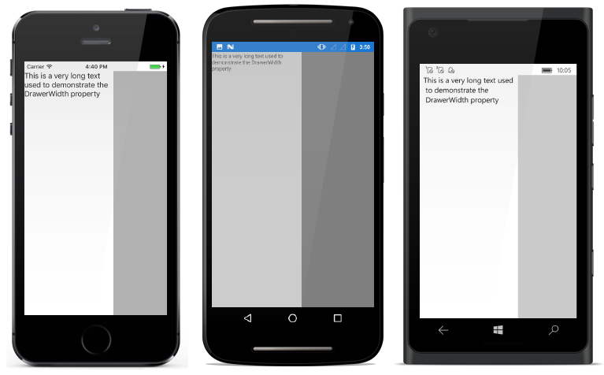

# Side Pane Sizing

The size of side pane can be adjusted using `DrawerHeight` and `DrawerWidth` properties.

## Drawer Height

`DrawerHeight` property is used to change the height of side pane when the Position is Top or Bottom.





<?xml version="1.0" encoding="utf-8"?>
<ContentPage xmlns="http://xamarin.com/schemas/2014/forms" 
             xmlns:x="http://schemas.microsoft.com/winfx/2009/xaml" 
             xmlns:local="clr-namespace:NaviSample" 
             xmlns:navigationdrawer="clr-namespace:Syncfusion.SfNavigationDrawer.XForms;assembly=Syncfusion.SfNavigationDrawer.XForms"
             x:Class="NaviSample.MainPage">
    <navigationdrawer:SfNavigationDrawer x:Name="navigationDrawer" 
                                         DrawerHeight="40" 
                                         Position="Top">       
        <navigationdrawer:SfNavigationDrawer.DrawerHeaderView>
            <Label Text="This is a very short content used to demonstrate the DrawerHeight property "/>            
        </navigationdrawer:SfNavigationDrawer.DrawerHeaderView>
    </navigationdrawer:SfNavigationDrawer>
</ContentPage>
	
	
	
 

Syncfusion.SfNavigationDrawer.XForms.SfNavigationDrawer navigationDrawer = new Syncfusion.SfNavigationDrawer.XForms.SfNavigationDrawer();

navigationDrawer.Position = Position.Top;

navigationDrawer.DrawerHeight = 40;

navigationDrawer.DrawerHeaderView = new Label()

{

    Text = "This is a very short content used to demonstrate the DrawerHeight property"

};

Content = navigationDrawer;





## Drawer Width

`DrawerWidth` property is used to change the width of side pane when the Position is Left or Right.





<?xml version="1.0" encoding="utf-8"?>
<ContentPage xmlns="http://xamarin.com/schemas/2014/forms" 
             xmlns:x="http://schemas.microsoft.com/winfx/2009/xaml" 
             xmlns:local="clr-namespace:NaviSample" 
             xmlns:navigationdrawer="clr-namespace:Syncfusion.SfNavigationDrawer.XForms;assembly=Syncfusion.SfNavigationDrawer.XForms"
             x:Class="NaviSample.MainPage">
    <navigationdrawer:SfNavigationDrawer x:Name="navigationDrawer" 
                                         DrawerWidth="200" 
                                         Position="Left">       
        <navigationdrawer:SfNavigationDrawer.DrawerHeaderView>
            <Label Text="This is a very short content used to demonstrate the DrawerHeight property "/>            
        </navigationdrawer:SfNavigationDrawer.DrawerHeaderView>
    </navigationdrawer:SfNavigationDrawer>
</ContentPage>
	
	
	
 

using System;
using Syncfusion.SfNavigationDrawer.XForms;
using Xamarin.Forms;

namespace NaviSample
{
    public partial class MainPage : ContentPage
    {
        public MainPage()
        {
            InitializeComponent();
            SfNavigationDrawer navigationDrawer = new SfNavigationDrawer()
            {
                Position = Position.Left,
                DrawerWidth = 200,
                DrawerHeaderView = new Label()
                {
                    Text = "This is a very short content used to demonstrate the DrawerHeight property"
                }
            };

            Content = navigationDrawer;
        }
    }
}





