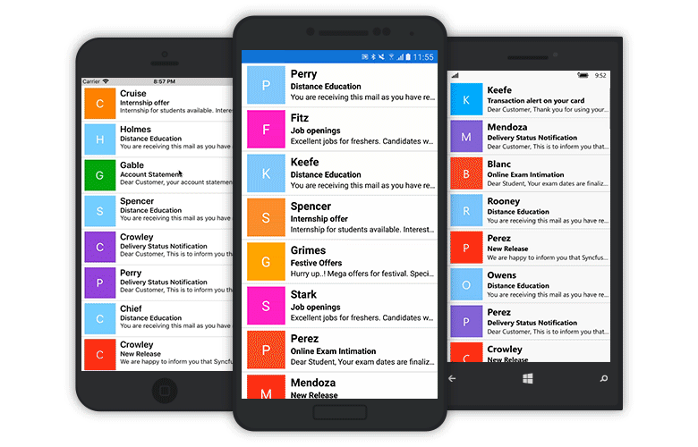
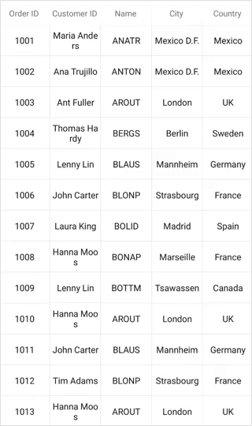

# Features

## PullableContent

Gets or sets the content of the refresh view. `PullableContent` is the main view of the `SfPullToRefresh` control on which the desired items can be placed.



  <syncfusion:SfPullToRefresh x:Name="pullToRefresh"
                              PullingThreshold="120"
                              RefreshContentHeight="30"
                              RefreshContentThreshold="30"
                              RefreshContentWidth="30">
     <syncfusion:SfPullToRefresh.PullableContent>
             <Label x:Name="Monthlabel" 
                    TextColor="White" 
                    HorizontalTextAlignment="Center"   
                    VerticalTextAlignment="Start" />
     </syncfusion:SfPullToRefresh.PullableContent>
  </syncfusion:SfPullToRefresh>



## TransitionMode

The `TransitionMode` property specifies the mode of the animations. It has the following two modes:

* `SlideOnTop`
* `Push`

The default transition is `SlideOnTop` that draws the RefreshContent on top of the `PullableContent`.





    <syncfusion:SfPullToRefresh x:Name="pullToRefresh" TransitionMode="SlideOnTop" />





    pullToRefresh.TransitionMode = TransitionType.SlideOnTop;





The following code example shows how to set `TransitionMode` as `Push` to SfPullToRefresh. This transition moves the refresh content and main content simultaneously.





    <syncfusion:SfPullToRefresh x:Name=" pullToRefresh" TransitionMode="Push" />





    pullToRefresh.TransitionMode = TransitionType.Push;





## RefreshContentThreshold

Gets or sets the refresh content threshold value that indicates progress indicator starting position in view





    <syncfusion:SfPullToRefresh x:Name="pullToRefresh" RefreshContentThreshold="50"/>





    pullToRefresh.RefreshContentThreshold = 50d;





## PullingThreshold

Gets or sets the value for the refresh content threshold, this indicate progress indicator maximum pulling position in view.





    <syncfusion:SfPullToRefresh x:Name="pullToRefresh" PullingThreshold="200"/>

 



    pullToRefresh.PullingThreshold = 200d;





## IsRefreshing

Get or set the state for refreshing the view. View will get refresh while `IsRefreshing` property is set `true` and View refreshing will be stopped when you set `IsRefreshing` is `false`.
 




    <syncfusion:SfPullToRefresh x:Name="pullToRefresh" IsRefreshing = "True"/>

 



    pullToRefresh.IsRefreshing = true;





## ProgressBackgroundColor

Get or set the background color to the progress indicator.





    <syncfusion:SfPullToRefresh x:Name="pullToRefresh" ProgressBackgroundColor = "White"/>

 



    pullToRefresh.ProgressBackgroundColor = Color.White;





## ProgressStrokeColor

Get or set the color to the progress indicator stroke 





    <syncfusion:SfPullToRefresh x:Name="pullToRefresh" ProgressStrokeColor = "Blue"/>

 



    pullToRefresh.ProgressStrokeColor = Color.Blue;





## ProgressStrokeWidth

Get or set the width to the progress indicator stroke. 





    <syncfusion:SfPullToRefresh x:Name="pullToRefresh" ProgressStrokeWidth="5"/>





    pullToRefresh.ProgressStrokeWidth = 5d;




## RefreshContentWidth

Get or set the width to the refresh content.





    <syncfusion:SfPullToRefresh x:Name="pullToRefresh" RefreshContentWidth="50"/>





    pullToRefresh.RefreshContentWidth = 50d;





## RefreshContentHeight

Get or set the width to the refresh content.





    <syncfusion:SfPullToRefresh x:Name="pullToRefresh" RefreshContentHeight="50"/>





    pullToRefresh.RefreshContentHeight = 50d;





## Programmatic Support 

### StartRefreshing()

StartRefreshing method is used to refresh the content without interaction in pullable content. When invoke this StartRefreshing() method,then Progress indicator will be shown. 





    pullToRefresh.StartRefreshing();





### EndRefreshing()

EndRefreshing method is used to ends the progress animation of `SfPullToRefresh`.





    pullToRefresh.EndRefreshing();





## Host SfDataGrid as pullable content

SfPullToRefresh controls provides support for loading any custom control as pullable content. To host SfDatagrid inside the SfPullToRefresh, follow the below steps.
<ol>

<li> Add the required assembly references to the pcl and renderer projects as discussed in the Assembly deployment section of <a href="https://help.syncfusion.com/xamarin/sfdatagrid/getting-started#assembly-deployment">SfDataGrid </a> and <a href="https://help.syncfusion.com/xamarin/sfpulltorefresh/getting-started#assembly-deployment">SfPullToRefresh </a>.</li>
<li>	Import SfPullToRefresh and SfDataGrid control namespace as follows.</li>

 





<xmlns:syncfusion="clr-namespace:Syncfusion.SfDataGrid.XForms;assembly=Syncfusion.SfDataGrid.XForms">          
<xmlns:pull="clr-namespace:Syncfusion.SfPullToRefresh.XForms;assembly=Syncfusion.SfPullToRefresh.XForms">





using Syncfusion.SfPullToRefresh.XForms;
using Syncfusion.SfDataGrid.XForms;





 

<li>	Define SfDataGrid as PullableContent of the SfPullToRefresh.</li> 
<li>	Handle the pull to refresh events for refreshing the data. </li>
<li>	Customize the required properties of SfDataGrid and SfPullToRefresh based on your requirement.</li> 

</ol>
This is how the final output will look like on iOS, Android and Windows Phone devices when hosting a SfDatagrid control as pullable content.



    <?xml version="1.0" encoding="utf-8" ?>
<ContentPage xmlns="http://xamarin.com/schemas/2014/forms"
             xmlns:x="http://schemas.microsoft.com/winfx/2009/xaml"
             xmlns:local="clr-namespace:PullToRefreshSample"
             x:Class="PullToRefreshSample.MainPage"
             xmlns:syncfusion="clr-namespace:Syncfusion.SfDataGrid.XForms;assembly=Syncfusion.SfDataGrid.XForms"
             xmlns:pull="clr-namespace:Syncfusion.SfPullToRefresh.XForms;assembly=Syncfusion.SfPullToRefresh.XForms">

    <ContentPage.BindingContext>
        <local:ViewModel x:Name="viewModel" />
    </ContentPage.BindingContext>

    <pull:SfPullToRefresh x:Name="pulltorefresh"
                           TransitionMode="SlideOnTop"
                           PullingThreshold="100"
                           RefreshContentHeight="30"
                           RefreshContentThreshold="40"
                           RefreshContentWidth="30">
        <pull:SfPullToRefresh.PullableContent>

            <syncfusion:SfDataGrid x:Name="dataGrid" 
                                   ItemsSource="{Binding OrdersInfo}" 
                                   AutoGenerateColumns="false">

                        <syncfusion:SfDataGrid.Columns>
                            <syncfusion:GridTextColumn MappingName="OrderID" />
                            <syncfusion:GridTextColumn MappingName="Customer"/>
                            <syncfusion:GridTextColumn MappingName="FirstName" />
                            <syncfusion:GridTextColumn MappingName="LastName" />
                            <syncfusion:GridTextColumn MappingName="Country" />
                        </syncfusion:SfDataGrid.Columns>

            </syncfusion:SfDataGrid>

        </pull:SfPullToRefresh.PullableContent>
    </pull:SfPullToRefresh>
</ContentPage>





using Syncfusion.SfPullToRefresh.XForms;
using Xamarin.Forms;
using Syncfusion.SfDataGrid.XForms;
namespace PullToRefreshSample
{
    public partial class MainPage : ContentPage
    {   
        public MainPage()
        {
            InitializeComponent();
            pulltorefresh.Refreshing += PullToRefresh_Refreshing;
            dataGrid.VerticalOverScrollMode=VerticalOverScrollMode.None;
        }

        private async void PullToRefresh_Refreshing(object sender, EventArgs args)
        {
            await Task.Delay(new TimeSpan(0, 0, 3));
            viewModel.ItemsSourceRefresh();
            pulltorefresh.IsRefreshing = false;
        }
    }
}

//Model class:

public class OrderInfo
{
    public OrderInfo()
    {
    }
    public string EmployeeID { get; internal set; }
    public object FirstName { get; internal set; }
    public object LastName { get; internal set; }
    public string Country { get; internal set; }
    public int OrderID { get; internal set; }
    public string Customer { get; internal set; }
}

//ViewModel Class:

public class ViewModel
    {
        Random random = new Random();
        public ViewModel()
        { 
        }

        #region ItemsSourceRefresh

        public void ItemsSourceRefresh()
        {
           for (int i = 1; i <= 5; i++)
            {
                this.OrdersInfo.Insert(0, order.RefreshItemsource(i));
            }
        }

        #endregion
    }

//OrderInfoRepository Class:

public class OrderInfoRepository
{
   public OrderInfoRepository()
   {
   }
   private Random random = new Random();

   #region GetOrderDetails

   public ObservableCollection<OrderInfo> GetOrderDetails(int count)
   {
   ObservableCollection<OrderInfo> orderDetails = new ObservableCollection<OrderInfo>();

            for (int i = 101; i <= count + 100; i++)
            {
                var order = new OrderInfo()
                {
                    OrderID = i,
                    Customer = Customer[random.Next(5)],
                    EmployeeID = random.Next(1700, 1800).ToString(),
                    FirstName = FirstNames[random.Next(5)],
                    LastName = LastNames[random.Next(5)],
                    Country = country[random.Next(5)],
                };
                orderDetails.Add(order);
            }
            return orderDetails;
    }
    public OrderInfo RefreshItemsource(int i)
    {
            var order = new OrderInfo()
            {
                OrderID = (i + random.Next(100,110)),                
                Customer = Customer[random.Next(5)],
                EmployeeID = random.Next(1700, 1800).ToString(),
                FirstName = FirstNames[random.Next(5)],
                LastName = LastNames[random.Next(5)],
                Country = country[random.Next(5)]
            };
            return order;
        }

        #endregion

        // Main DataSources

        string[] FirstNames = new string[] {"Kyle","Gina","Irene","Katie","Michael"};
        string[] LastNames = new string[] {"Adams","Crowley","Ellis","Gable","Irvine"};
        string[] Customer = new string[] {"Alfie","Frans","Mered","Folios","Simon"};
        string[] country = new string[] {"US","Australia","Canada","UK","India"};
      }



If we run the above sample with TransitionMode as Push, the output will look like on iOS, Android and Windows Phone devices as shown below.

## Host SfListView as pullable content

To host SfListView inside the SfPullToRefresh which is used to update items in the list while performing the pull to refresh action.
<ol>
<li>	Add the required assembly references to the pcl and renderer projects as discussed in the Assembly deployment section of <a href="https://help.syncfusion.com/xamarin/sflistview/getting-started#assembly-deployment">SfListView </a> and <a href="https://help.syncfusion.com/xamarin/sfpulltorefresh/getting-started#assembly-deployment">SfPullToRefresh </a>.</li>
<li>	Import SfPullToRefresh control and SfListView control namespace as follows.</li>
 



<xmlns:syncfusion="clr-namespace:Syncfusion.ListView.XFormsassembly=Syncfusion.SfListView.XForms">      
<xmlns:pull="clr-namespace:Syncfusion.SfPullToRefresh.XFormsassembly=Syncfusion.SfPullToRefreshXForms">


using Syncfusion.SfPullToRefresh.XForms;
using Syncfusion.ListView.XForms;


 
<li>	Define SfListView as PullableContent of the SfPullToRefresh.</li>
<li>	Handle the pull to refresh events for refreshing the data. </li>
<li>	Customize the required properties of SfListView and SfPullToRefresh based on your requirement.</li>
</ol>

This is how the final output will look like on iOS, Android and Windows Phone devices when hosting a SfListView control as pullable content.



<?xml version="1.0" encoding="utf-8" ?>
<ContentPage xmlns="http://xamarin.com/schemas/2014/forms"
             xmlns:x="http://schemas.microsoft.com/winfx/2009/xaml"
             xmlns:local="clr-namespace:ListviewPulltorefresh"
             x:Class="ListviewPulltorefresh.MainPage"
             xmlns:syncfusion="clr-namespace:Syncfusion.ListView.XForms;assembly=Syncfusion.SfListView.XForms"
             xmlns:pullToRefresh="clr-namespace:Syncfusion.SfPullToRefresh.XForms;assembly=Syncfusion.SfPullToRefresh.XForms" >

    <ContentPage.BindingContext>
        <local:InboxRepositiory x:Name="ViewModel" />
    </ContentPage.BindingContext>

    <ContentPage.Content>
        <pullToRefresh:SfPullToRefresh x:Name="pullToRefresh" 
                                       PullingThreshold="60" 
                                       ProgressStrokeWidth="5" 
                                       ProgressBackgroundColor="CornflowerBlue" 
                                       ProgressStrokeColor="White" 
                                       RefreshContentWidth="40" 
                                       RefreshContentHeight="40" 
                                       TransitionMode="Push" 
                                       IsRefreshing="False">
            <pullToRefresh:SfPullToRefresh.PullableContent>
                <syncfusion:SfListView x:Name="listView" 
                                       ItemSize="80" 
                                       ItemsSource="{Binding InboxItems}"  
                                       ItemSpacing="0,0,0,1" 
                                       BackgroundColor="LightGray"
                                       SelectionMode="None">
                    <syncfusion:SfListView.ItemTemplate>
                        <DataTemplate>
                            <Grid ColumnSpacing="5" BackgroundColor="White" Padding="5" >

                                <Grid.ColumnDefinitions>
                                    <ColumnDefinition Width="80" />
                                    <ColumnDefinition Width="*"/>
                                </Grid.ColumnDefinitions>

                                <StackLayout Grid.Column="0"  
                                             HeightRequest="70" 
                                             WidthRequest="70"  
                                             VerticalOptions="Center" 
                                             HorizontalOptions="Center" 
                                             BackgroundColor="{Binding BackgroundColor}">

                                    <Grid  HorizontalOptions="CenterAndExpand"
                                           VerticalOptions="CenterAndExpand" >

                                        <Label Text="{Binding DisplayString}" 
                                               TextColor="White" 
                                               FontSize="25" 
                                               HorizontalOptions="CenterAndExpand" 
                                               VerticalOptions="CenterAndExpand"/>
                                    </Grid>
                                    
                                </StackLayout>

                                <Grid Grid.Column="1" RowSpacing="0">

                                    <Grid.RowDefinitions>
                                        <RowDefinition Height="Auto"/>
                                        <RowDefinition Height="Auto" />
                                        <RowDefinition Height="Auto" />
                                    </Grid.RowDefinitions>

                                    <Label Text="{Binding Sender}" 
                                           TextColor="Black" 
                                           FontAttributes="Bold" 
                                           FontSize="20"/>
                                    <Label Grid.Row="1" 
                                           FontSize = "15" 
                                           TextColor="Black" 
                                           FontAttributes="Bold" 
                                           Text="{Binding Subject}" 
                                           LineBreakMode="TailTruncation"  />
                                    <Label Grid.Row="2" 
                                           FontSize="14" 
                                           TextColor="Black" 
                                           Text="{Binding Details}" 
                                           LineBreakMode="TailTruncation" />
                                </Grid>
                                
                            </Grid>
                        </DataTemplate>
                    </syncfusion:SfListView.ItemTemplate>
                </syncfusion:SfListView>
            </pullToRefresh:SfPullToRefresh.PullableContent>
        </pullToRefresh:SfPullToRefresh>
    </ContentPage.Content>
</ContentPage>
    





using Syncfusion.SfPullToRefresh.XForms;
using Xamarin.Forms;
using Syncfusion.ListView.XForms;
namespace PullToRefreshSample
{
    public partial class MainPage : ContentPage
    {   
        public MainPage()
        {
            InitializeComponent();
            pullToRefresh.Refreshing += PullToRefresh_Refreshing; ;
        }

        private async void PullToRefresh_Refreshing(object sender, EventArgs e)
        {
            pullToRefresh.IsRefreshing = true;
            await Task.Delay(2000);
            ViewModel.RefreshItemSource();
            pullToRefresh.IsRefreshing = false;
        }
    }
}



If we run the above sample with TransitionMode as Push, the output will look like on iOS, Android and Windows Phone devices as shown below.

## Pulling and refreshing template

The `SfPullToRefresh` allows you set a template for pulling and refreshing the view. The pulling and refreshing a template can be set using the [SfPullToRefresh.PullingViewTemplate](https://help.syncfusion.com/cr/xamarin/Syncfusion.SfPullToRefresh.XForms.SfPullToRefresh.html#Syncfusion_SfPullToRefresh_XForms_SfPullToRefresh_PullingViewTemplate) and [SfPullToRefresh.RefreshingViewTemplate](https://help.syncfusion.com/cr/xamarin/Syncfusion.SfPullToRefresh.XForms.SfPullToRefresh.html#Syncfusion_SfPullToRefresh_XForms_SfPullToRefresh_RefreshingViewTemplate) properties, respectively.

Refer to the following code example in which a `SfProgressBar` is loaded in the pulling view template and refreshing view template.



<?xml version="1.0" encoding="utf-8" ?>
<ContentPage xmlns="http://xamarin.com/schemas/2014/forms"
             xmlns:x="http://schemas.microsoft.com/winfx/2009/xaml"
             xmlns:local="clr-namespace:SfPullToRefresh"
             x:Class="SfPullToRefresh.MainPage"
             xmlns:dataGrid="clr-namespace:Syncfusion.SfDataGrid.XForms;assembly=Syncfusion.SfDataGrid.XForms" 
             xmlns:pullToRefresh="clr-namespace:Syncfusion.SfPullToRefresh.XForms;assembly=Syncfusion.SfPullToRefresh.XForms">
    <ContentPage.BindingContext>
        <local:OrderInfoRepository x:Name="viewModel"/>
    </ContentPage.BindingContext>
    <ContentPage.Content>
        <pullToRefresh:SfPullToRefresh x:Name="pullToRefresh"
                                       RefreshContentHeight="50"
                                       RefreshContentThreshold="40"
                                       PullingThreshold="150"                                          
                                       RefreshContentWidth="50"
                                       ProgressStrokeWidth="8"
                                       TransitionMode="SlideOnTop"
                                       IsRefreshing="False">
            <pullToRefresh:SfPullToRefresh.PullableContent>
                <dataGrid:SfDataGrid x:Name="dataGrid" 
                                     AutoGenerateColumns="False"
                                     ItemsSource="{Binding OrderInfoCollection}"
                                     ColumnSizer="Star">
                    <dataGrid:SfDataGrid.Columns>
                        <dataGrid:GridTextColumn MappingName="OrderID" HeaderText="Order ID"/>
                        <dataGrid:GridTextColumn MappingName="CustomerID" HeaderText="Customer ID"/>
                        <dataGrid:GridTextColumn MappingName="Customer" HeaderText="Name"/>
                        <dataGrid:GridTextColumn MappingName="ShipCity" HeaderText="City"/>
                        <dataGrid:GridTextColumn MappingName="ShipCountry" HeaderText="Country"/>
                    </dataGrid:SfDataGrid.Columns>
                </dataGrid:SfDataGrid>
            </pullToRefresh:SfPullToRefresh.PullableContent>
        </pullToRefresh:SfPullToRefresh>
    </ContentPage.Content>
</ContentPage>





public partial class MainPage : ContentPage
{
    private SfCircularProgressBar progressbar;
    private SfBorder border;
    public MainPage()
    {
        InitializeComponent();
        this.progressbar = new SfCircularProgressBar();
        this.border = new SfBorder();

        this.border.BorderColor = Color.LightGray;
        this.border.BackgroundColor = Color.White;
        this.border.CornerRadius = 35;
        this.border.Content = this.progressbar;
        this.border.BorderWidth = 0.2;

        this.progressbar.SegmentCount = 10;
        this.progressbar.IndicatorInnerRadius = 0.5;
        this.progressbar.IndicatorOuterRadius = 0.7;
        this.progressbar.ShowProgressValue = true;
        this.progressbar.GapWidth = 0.5;
        this.progressbar.WidthRequest = 70;
        this.progressbar.HeightRequest = 55;
        this.progressbar.IndeterminateAnimationDuration = 750;

        var pullingTemplate = new DataTemplate(() =>
        {
            return new ViewCell { View = this.border };
        });

        this.pullToRefresh.Refreshing += this.PullToRefresh_Refreshing;
        this.pullToRefresh.Pulling += this.PullToRefresh_Pulling;

        this.pullToRefresh.PullingViewTemplate = pullingTemplate;
        this.pullToRefresh.RefreshingViewTemplate = pullingTemplate;
    }

    private async void pullToRefresh_Refreshing(object sender, EventArgs e)
    {
        pullToRefresh.IsRefreshing = true;
        await Task.Delay(new TimeSpan(0, 0, 3));
        viewModel.ItemsSourceRefresh();
        pullToRefresh.IsRefreshing = false;
    }

    private void PullToRefresh_Pulling(object sender, PullingEventArgs e)
    {
        this.progressbar.TrackInnerRadius = 0.8;
        this.progressbar.TrackOuterRadius = 0.1;
        this.progressbar.IsIndeterminate = false;
        this.progressbar.ProgressColor = Color.FromRgb(0, 124, 238);
        this.progressbar.TrackColor = Color.White;

        var absoluteProgress = Math.Abs(e.Progress);
        this.progressbar.Progress = absoluteProgress;
        this.progressbar.SetProgress(absoluteProgress, 1, Easing.CubicInOut);
    }

    private async void PullToRefresh_Refreshing(object sender, EventArgs e)
    {
        this.pullToRefresh.IsRefreshing = true;
        await this.AnimateRefresh();

        this.progressbar.TrackInnerRadius = 0.1;
        this.progressbar.TrackOuterRadius = 0.9;

        this.viewModel.ItemsSourceRefresh();
        this.pullToRefresh.IsRefreshing = false;
    }

    private async Task AnimateRefresh()
    {
        this.progressbar.Progress = 0;
        this.progressbar.IsIndeterminate = true;

        await Task.Delay(750);
        this.progressbar.ProgressColor = Color.Red;

        await Task.Delay(750);
        this.progressbar.ProgressColor = Color.Green;

        await Task.Delay(750);
        this.progressbar.ProgressColor = Color.Orange;

        await Task.Delay(750);
    }
} 



You can download the sample code by clicking the following link: [Sample](https://github.com/SyncfusionExamples/how-to-set-template-for-pulling-and-refreshing-view-in-xamarin-forms-pulltorefresh).