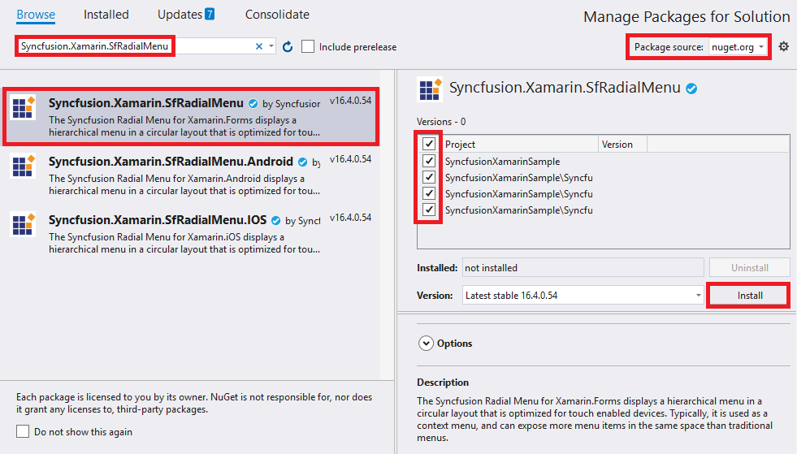
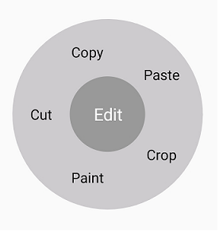

# Getting Started

This section explains the steps required to launch the radial menu with hierarchical items that can be used as mobile phone system settings. This section covers only the minimal features that needed to get started with the radial menu.

## Adding SfRadialMenu reference

You can add SfRadialMenu reference using one of the following methods:

**Method 1: Adding SfRadialMenu reference from nuget.org**

Syncfusion Xamarin components are available in [nuget.org](https://www.nuget.org/). To add SfRadialMenu to your project, open the NuGet package manager in Visual Studio, search for [Syncfusion.Xamarin.SfRadialMenu](https://www.nuget.org/packages/Syncfusion.Xamarin.SfRadialMenu), and then install it.

N> Install the same version of SfRadialMenu NuGet in all the projects.

**Method 2: Adding SfRadialMenu reference from toolbox**

Syncfusion also provides Xamarin Toolbox. Using this toolbox, you can drag the SfRadialMenu control to the XAML page. It will automatically install the required NuGet packages and add the namespace to the page. To install Syncfusion Xamarin Toolbox, refer to [Toolbox](https://help.syncfusion.com/xamarin/utility#toolbox).

**Method 3: Adding SfRadialMenu assemblies manually from the installed location**

If you prefer to manually reference the assemblies instead referencing from NuGet, add the following assemblies in respective projects.

Location: {Installed location}/{version}/Xamarin/lib

<table>
<tr>
<td>PCL</td>
<td>Syncfusion.SfRadialMenu.XForms.dll Syncfusion.Core.XForms.dll Syncfusion.Licensing.dll </td>
</tr>
<tr>
<td>Android</td>
<td>Syncfusion.SfRadialMenu.Android.dll Syncfusion.SfRadialMenu.XForms.Android.dll Syncfusion.SfRadialMenu.XForms.dll Syncfusion.Core.XForms.dll Syncfusion.Core.XForms.Android.dll Syncfusion.Licensing.dll </td>
</tr>
<tr>
<td>iOS</td>
<td>Syncfusion.SfRadialMenu.iOS.dll Syncfusion.SfRadialMenu.XForms.iOS.dll Syncfusion.SfRadialMenu.XForms.dll Syncfusion.Core.XForms.dll Syncfusion.Core.XForms.iOS.dll Syncfusion.Licensing.dll </td>
</tr>
<tr>
<td>UWP</td>
<td>Syncfusion.SfRadialMenu.UWP.dll Syncfusion.SfRadialMenu.XForms.UWP.dll Syncfusion.SfRadialMenu.XForms.dll Syncfusion.SfShared.UWP.dll Syncfusion.Core.XForms.dll Syncfusion.Core.XForms.UWP.dll Syncfusion.Licensing.dll </td>
</tr>
</table>

N> To know more about obtaining our components, refer to these links for [Mac](https://help.syncfusion.com/xamarin/introduction/download-and-installation/mac/) and [Windows](https://help.syncfusion.com/xamarin/introduction/download-and-installation/windows/).

I> Starting with v16.2.0.x, if you reference Syncfusion assemblies from the trial setup or from the NuGet feed, you also have to include a license key in your projects. Please refer to [Syncfusion license key](https://help.syncfusion.com/common/essential-studio/licensing/license-key/) to know about registering Syncfusion license key in your Xamarin application to use our components.

### Additional step for iOS

To launch [`SfRadialMenu`](https://help.syncfusion.com/cr/xamarin/Syncfusion.SfRadialMenu.XForms.SfRadialMenu.html) in iOS, call `SfRadialMenuRenderer.Init()` in the `FinishedLaunching` overridden method of the `AppDelegate` class in the iOS project as demonstrated in the following code example.


public override bool FinishedLaunching(UIApplication app, NSDictionary options)
{
    …
    global::Xamarin.Forms.Forms.Init ();
    SfRadialMenuRenderer.Init();
    LoadApplication (new App ());
    …
}
 

### Additional step for UWP 

This step is required only if the application is deployed in release mode with .NET native tool chain enabled. It is needed for resolving the known Framework issue “Custom controls not rendering in Release mode” in UWP platform. Initializing the [`SfRadialMenu`](https://help.syncfusion.com/cr/xamarin/Syncfusion.SfRadialMenu.XForms.SfRadialMenu.html) assembly at the `OnLaunched` overridden method of the `App` class in UWP project is the suggested workaround. The following code example demonstrates how to initialize the [`SfRadialMenu`](https://help.syncfusion.com/cr/xamarin/Syncfusion.SfRadialMenu.XForms.SfRadialMenu.html) assembly.



// In App.xaml.cs

protected override void OnLaunched(LaunchActivatedEventArgs e)
{
	…

	rootFrame.NavigationFailed += OnNavigationFailed;
		
	// you'll need to add `using System.Reflection;`
	List<Assembly> assembliesToInclude = new List<Assembly>();

	//Now, add all the assemblies your app uses
	assembliesToInclude.Add(typeof(SfRadialMenuRenderer).GetTypeInfo().Assembly);

	// replaces Xamarin.Forms.Forms.Init(e);        
	Xamarin.Forms.Forms.Init(e, assembliesToInclude);
	…     
}
 

## Creating a simple radial menu

The [`SfRadialMenu`](https://help.syncfusion.com/cr/xamarin/Syncfusion.SfRadialMenu.XForms.SfRadialMenu.html) control is configured entirely in C# code or in XAML markup. The following steps explain how to create [`SfRadialMenu`](https://help.syncfusion.com/cr/xamarin/Syncfusion.SfRadialMenu.XForms.SfRadialMenu.html) and configure its elements:

### Create the project

Create a new BlankApp (Xamarin.Forms.Portable) application in Xamarin Studio or Visual Studio for Xamarin.Forms.

### Adding radial menu in Xamarin.Forms 

1. Add the required assembly references to the pcl and renderer projects. 

2. Add namespace for the referred assemblies.



xmlns:radialMenu="clr-namespace:Syncfusion.SfRadialMenu.XForms;assembly=Syncfusion.SfRadialMenu.XForms"


using Syncfusion.XForms.SfRadialMenu;



3. Set the radial menu control as content to the ContentPage.





    <?xml version="1.0" encoding="utf-8" ?>
    <ContentPage xmlns="http://xamarin.com/schemas/2014/forms"
             xmlns:x="http://schemas.microsoft.com/winfx/2009/xaml"
             xmlns:local="clr-namespace:GettingStarted"
              xmlns:radialMenu="clr-namespace:Syncfusion.SfRadialMenu.XForms;assembly=Syncfusion.SfRadialMenu.XForms"
             x:Class="GettingStarted.MainPage">
    <ContentPage.Content>
        <radialMenu:SfRadialMenu x:Name="radialMenu"/>
    </ContentPage.Content>
</ContentPage>





    using Syncfusion.SfRadialMenu.XForms;
    using Xamarin.Forms;

    namespace GettingStarted
    {
        public partial class MainPage : ContentPage
        {
            public MainPage()
            {
                SfRadialMenu radialMenu = new SfRadialMenu();
                this.Content = radialMenu;
            }
        }
    }





### Adding radial menu with items





<?xml version="1.0" encoding="utf-8" ?>
<ContentPage xmlns="http://xamarin.com/schemas/2014/forms"
             xmlns:x="http://schemas.microsoft.com/winfx/2009/xaml"
             xmlns:local="clr-namespace:RadialSample"
             xmlns:radialMenu="clr-namespace:Syncfusion.SfRadialMenu.XForms;assembly=Syncfusion.SfRadialMenu.XForms"
             x:Class="RadialSample.MainPage">
    <radialMenu:SfRadialMenu x:Name="radialMenu" 
                             CenterButtonText="Edit"
                             CenterButtonFontSize="15">
        <radialMenu:SfRadialMenu.Items>
            <radialMenu:SfRadialMenuItem Text="Cut"
                                         FontSize="15"/>
            <radialMenu:SfRadialMenuItem Text="Copy"
                                         FontSize="15"/>
            <radialMenu:SfRadialMenuItem Text="Paste"
                                         FontSize="15"/>
            <radialMenu:SfRadialMenuItem Text="Crop"
                                         FontSize="15"/>
            <radialMenu:SfRadialMenuItem Text="Paint"
                                         FontSize="15"/>
        </radialMenu:SfRadialMenu.Items>
    </radialMenu:SfRadialMenu>
</ContentPage>





using Syncfusion.SfRadialMenu.XForms;
using System.Collections.ObjectModel;
using Xamarin.Forms;

namespace RadialSample
{
    public partial class MainPage : ContentPage
    {
        public MainPage()
        {
            InitializeComponent();
            SfRadialMenu radialMenu = new SfRadialMenu()
            {
                CenterButtonText = "Edit",
                CenterButtonFontSize = 15
            };
            ObservableCollection<SfRadialMenuItem> itemCollection = new ObservableCollection<SfRadialMenuItem>();
            itemCollection.Add(new SfRadialMenuItem()
            {
                Text = "Cut",
                FontSize = 15
            });
            itemCollection.Add(new SfRadialMenuItem()
            {
                Text = "Copy",
                FontSize = 15
            });
            itemCollection.Add(new SfRadialMenuItem()
            {
                Text = "Paste",
                FontSize = 15
            });
            itemCollection.Add(new SfRadialMenuItem()
            {
                Text = "Crop",
                FontSize = 15
            });
            itemCollection.Add(new SfRadialMenuItem()
            {
                Text = "Paint",
                FontSize = 15
            });
            radialMenu.Items = itemCollection;
            this.Content = radialMenu;
        }
    }
}





We have attached sample for reference. You can download the sample from the following link.

Sample link:[GettingStarted](http://www.syncfusion.com/downloads/support/directtrac/general/ze/GettingStarted472180230.zip)

